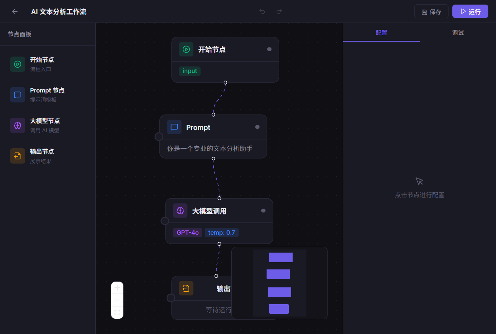

# MyCoze — Agent 可视化编排与调试平台

一个面向 AI Agent 工作流场景的可视化编排与调试平台。用户可以通过拖拽节点、连线配置的方式组装 AI 工作流，一键运行并实时查看每个节点的执行状态与输入输出。

## 预览

| 首页 | 编辑器 |
|------|--------|
|  |  |

## 核心功能

- **可视化编排画布** — 拖拽添加节点、自由连线、缩放平移，支持 4 种节点类型（开始 / Prompt / 大模型调用 / 输出）
- **自研流程执行引擎** — 基于 Kahn 算法拓扑排序确定执行顺序，支持跨节点变量插值（`{{变量名}}`）传递数据
- **断点调试** — 任意节点设置断点，引擎运行到断点处暂停，手动恢复后继续执行
- **全链路流程校验** — 环路检测、连通性检查、必填字段验证，编排时实时拦截非法连线
- **实时调试面板** — 运行时节点状态实时同步（运行中脉冲动画 / 成功绿色 / 失败红色），逐节点展示输入输出和耗时
- **撤销重做** — 基于 structuredClone 全量快照 + 双栈实现，支持 Ctrl+Z / Ctrl+Shift+Z
- **流程持久化** — localStorage 保存 / 加载 / 删除，支持多流程管理

## 技术栈

React 19 · Vite 8 · React Router v6 · [ReactFlow](https://reactflow.dev/) · CSS Modules · localStorage

## 项目结构

```
src/pages/Editor/
├── Editor.jsx              # 编辑器主组件，管理全局状态
├── engine/                 # 执行引擎层（纯逻辑，不依赖 React）
│   ├── FlowEngine.js       # 流程执行引擎：逐节点执行、断点暂停/恢复
│   ├── topologicalSort.js   # Kahn 算法拓扑排序 + 环路检测
│   ├── validator.js         # 流程校验：连通性、必填字段、环路
│   └── llmService.js        # 大模型调用：真实 API + 模拟响应双模式
├── hooks/                  # 状态桥接层
│   ├── useFlowExecution.js  # 引擎回调 → React 状态
│   └── useUndoRedo.js       # 撤销重做（快照 + 双栈）
├── nodes/                  # 自定义节点组件
└── components/             # 编辑器 UI 组件（画布、配置面板、调试面板等）
```

## 本地运行

```bash
git clone git@github.com:z-stefanie/myCoze.git
cd myCoze
npm install
npm run dev
```

浏览器访问 `http://localhost:5173`，进入编辑器后拖拽节点到画布即可开始编排。

## License

MIT
